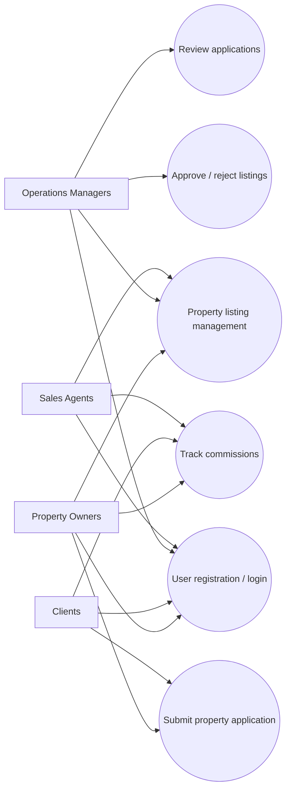
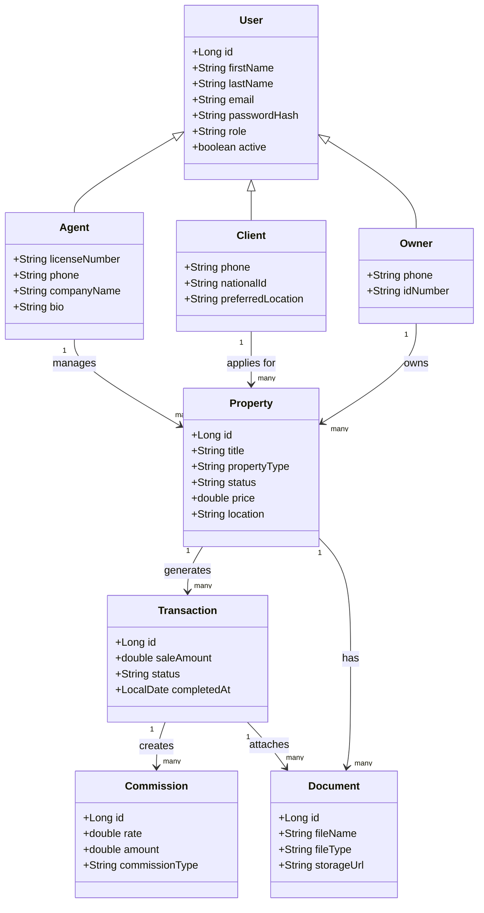
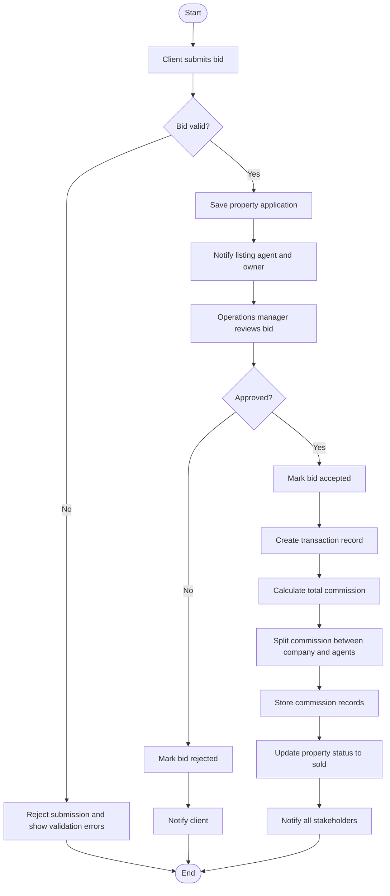
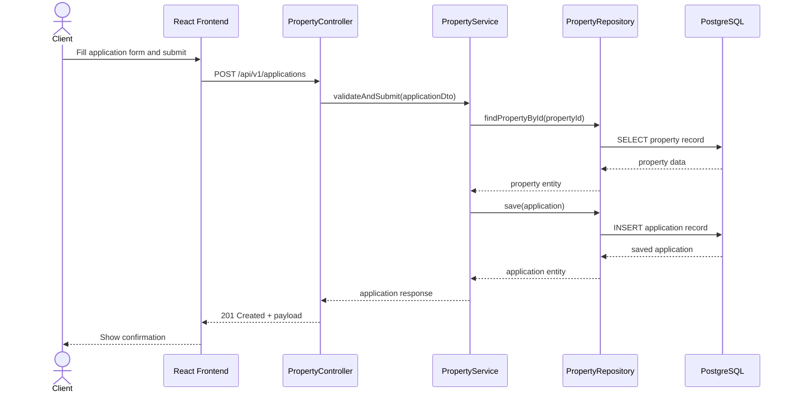
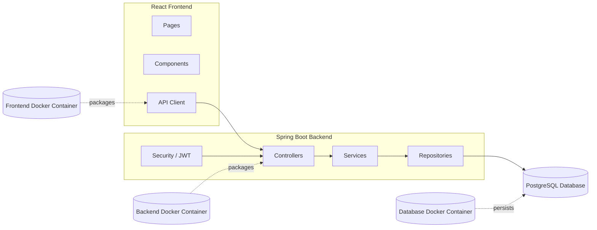

# VZZ Brokerage UML Overview

This repository contains the HomeQuest prototype, adapted here as the VZZ Brokerage system documentation set.
The diagrams below capture the main actors, data model, workflows, and software components for the brokerage platform.

## 1. Use Case Diagram

Actors:

- Sales Agents
- Operations Managers
- Clients
- Property Owners

Main use cases:

- User registration and login
- Property listing management
- Submitting property applications
- Tracking commissions

## 2. Class Diagram

Core entities:

- Property
- User
- Agent
- Client
- Owner

Supporting operations:

- Transaction
- Commission
- Document

## 3. Activity Diagram

This flow shows the internal working of the brokerage from bid submission to approval and commission calculation.

## 4. Sequence Diagram

This sequence models property application submission.

## 5. Component Diagram

This diagram shows the major physical components and their dependencies.

## Notes

- The diagrams are written in Mermaid so they can be rendered directly in GitHub and many Markdown viewers.
- The terms VZZ Brokerage and HomeQuest refer to the same project structure in this repository.
- For implementation details, see the root-level `SYSTEM_README.md` and the module-specific READMEs in `backend/` and `frontend/`.
