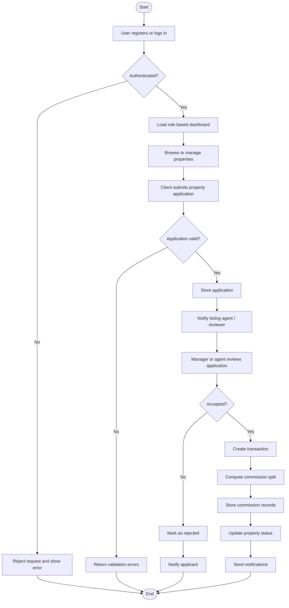
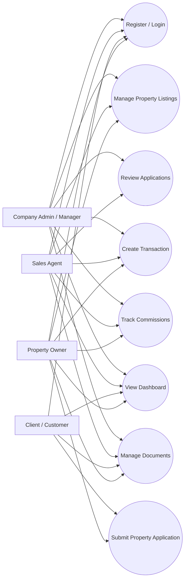
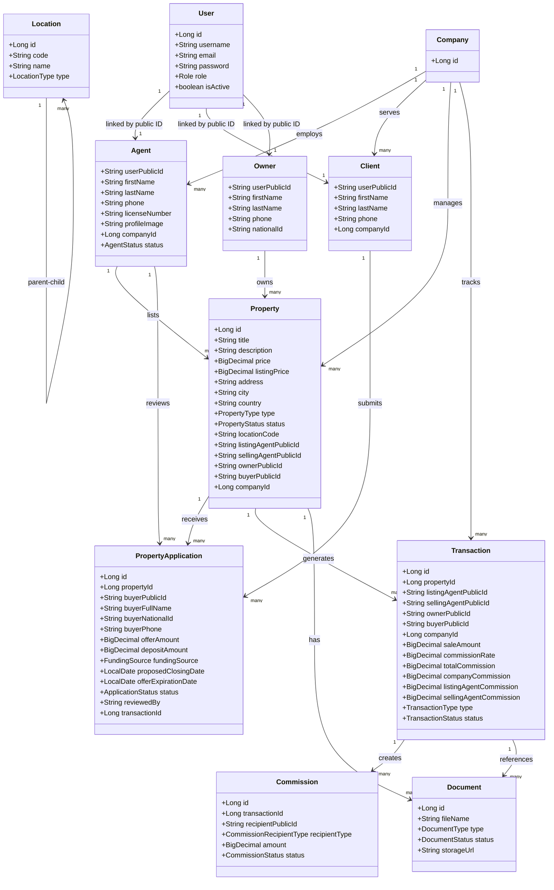
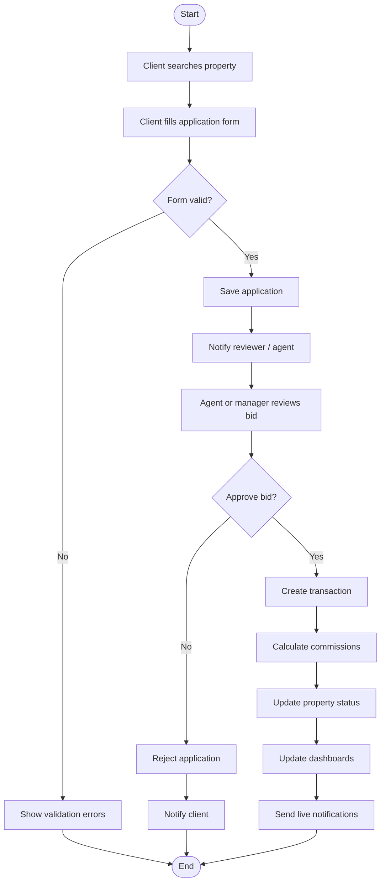
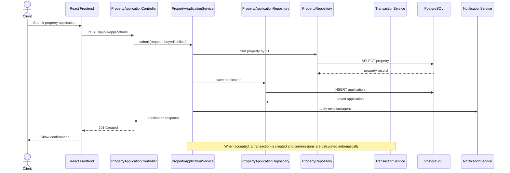
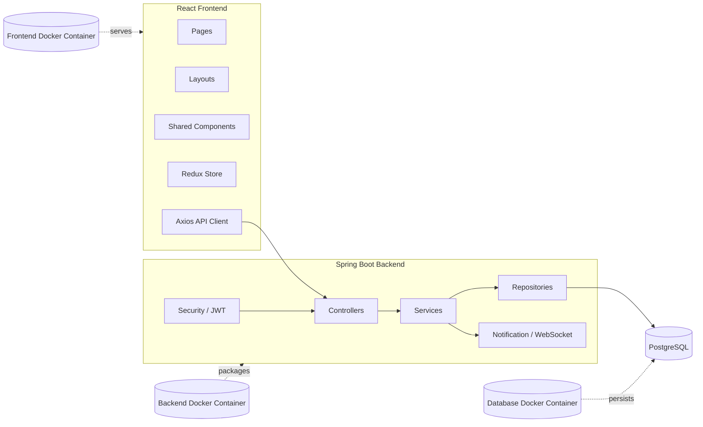

# HomeQuest / VZZ Brokerage Final Project Report

**Course:** SENG 8240 - Best Programming Practices and Design Patterns  
**Project Title:** Real Estate Brokerage Management System  
**Case Study:** VZZ Brokerage - Rwanda Branch Expansion  
**Prepared By:** Afanyu Emmanuel  
**Student ID:** 26841  
**Academic Year:** 2025/2026

## Abstract

This report presents the analysis, design, prototype implementation, deployment approach, version control strategy, and test plan for **HomeQuest**, a real estate brokerage management system developed for **VZZ Brokerage** in the context of its expansion into Rwanda. The application was designed to address the business and operational challenges of managing property listings, buyer applications, transactions, commissions, documents, and role-based access within a growing brokerage environment.

The system is implemented as a full-stack web application using a **Spring Boot** backend and a **React/Vite** frontend. The backend provides secure REST APIs, JWT authentication, role-based authorization, database persistence, scheduled background jobs, and notification support. The frontend provides role-specific dashboards, property browsing, application workflows, and shared UI components. The solution is built around clean architecture principles, repository-based persistence, reusable components, and containerized deployment using Docker.

The report is organized into four phases that align with the assignment requirements:

1. System analysis and design
2. Prototype development and design patterns
3. Dockerization and version control setup
4. Software testing and verification

## Table of Contents

- [Abstract](#abstract)
- [1. Introduction](#1-introduction)
- [2. General Description and Case Study Analysis](#2-general-description-and-case-study-analysis)
  - [2.1 Case Study Background](#21-case-study-background)
  - [2.2 General Description of the Proposed System](#22-general-description-of-the-proposed-system)
  - [2.3 Why the Case Study Needs This System](#23-why-the-case-study-needs-this-system)
- [3. Problem Faced by the Company](#3-problem-faced-by-the-company)
  - [3.1 Fragmented Data Management](#31-fragmented-data-management)
  - [3.2 Poor Operational Visibility](#32-poor-operational-visibility)
  - [3.3 Manual and Error-Prone Workflow](#33-manual-and-error-prone-workflow)
  - [3.4 Scaling Challenges](#34-scaling-challenges)
- [4. Functional Diagram and Internal Working of the Case Study](#4-functional-diagram-and-internal-working-of-the-case-study)
- [5. Object-Oriented System Analysis and Design](#5-object-oriented-system-analysis-and-design)
  - [5.1 Use Case Diagram](#51-use-case-diagram)
  - [5.2 Class Diagram](#52-class-diagram)
  - [5.3 Activity Diagram](#53-activity-diagram)
  - [5.4 Sequence Diagram](#54-sequence-diagram)
  - [5.5 Component Diagram](#55-component-diagram)
- [6. Prototype Summary](#6-prototype-summary)
  - [6.1 Purpose of the Prototype](#61-purpose-of-the-prototype)
  - [6.2 What the Current Prototype Demonstrates](#62-what-the-current-prototype-demonstrates)
  - [6.3 Best Programming Practices Applied](#63-best-programming-practices-applied)
  - [6.4 Google Coding Standards Alignment](#64-google-coding-standards-alignment)
- [7. Design Pattern Used](#7-design-pattern-used)
  - [7.1 Repository Pattern](#71-repository-pattern)
  - [7.2 Where It Appears in the Codebase](#72-where-it-appears-in-the-codebase)
  - [7.3 How the Pattern Supports the System](#73-how-the-pattern-supports-the-system)
  - [7.4 Why This Pattern Was Chosen](#74-why-this-pattern-was-chosen)
  - [7.5 Example from the Codebase](#75-example-from-the-codebase)
- [8. Software Development Prototype and Implementation Notes](#8-software-development-prototype-and-implementation-notes)
  - [8.1 Backend Prototype Characteristics](#81-backend-prototype-characteristics)
  - [8.2 Frontend Prototype Characteristics](#82-frontend-prototype-characteristics)
  - [8.3 Why the Prototype Is Useful](#83-why-the-prototype-is-useful)
- [9. Dockerization](#9-dockerization)
  - [9.1 Meaning of Dockerization](#91-meaning-of-dockerization)
  - [9.2 Dockerization Process](#92-dockerization-process)
  - [9.3 Docker Support in the Repository](#93-docker-support-in-the-repository)
  - [9.4 How the Application Is Run in Docker](#94-how-the-application-is-run-in-docker)
  - [9.5 Why Docker Matters for This Project](#95-why-docker-matters-for-this-project)
- [10. Version Control System Setup](#10-version-control-system-setup)
  - [10.1 Version Control Purpose](#101-version-control-purpose)
  - [10.2 SVN Setup Strategy](#102-svn-setup-strategy)
  - [10.3 What Should Be Stored in Version Control](#103-what-should-be-stored-in-version-control)
  - [10.4 What Should Be Ignored](#104-what-should-be-ignored)
  - [10.5 Why VCS Is Important in This Project](#105-why-vcs-is-important-in-this-project)
- [11. Software Test Plan](#11-software-test-plan)
  - [11.1 Test Objective](#111-test-objective)
  - [11.2 Test Scope](#112-test-scope)
  - [11.3 Types of Testing](#113-types-of-testing)
  - [11.4 Sample Test Cases](#114-sample-test-cases)
  - [11.5 Entry and Exit Criteria](#115-entry-and-exit-criteria)
- [12. Implementation Evidence from the Codebase](#12-implementation-evidence-from-the-codebase)
- [13. How to Run the Project](#13-how-to-run-the-project)
  - [13.1 Backend](#131-backend)
  - [13.2 Frontend](#132-frontend)
  - [13.3 Dockerized Run](#133-dockerized-run)
- [14. Demo Accounts](#14-demo-accounts)
- [15. Conclusion](#15-conclusion)
- [16. Notes](#16-notes)

## 1. Introduction

Modern brokerage operations require more than a simple listing website. A real estate company must manage properties, owners, buyers, agents, commissions, approvals, documents, and transaction histories in a way that is secure, traceable, and easy to maintain. Manual workflows or disconnected spreadsheets are not enough once the organization begins to grow.

The HomeQuest system was developed to solve this problem for VZZ Brokerage. It provides a central digital platform that supports the full brokerage lifecycle from property listing to final transaction. The application also reflects software engineering best practices required in a course on programming quality and design patterns.

The implementation in this repository shows a practical prototype rather than a theoretical idea. The codebase includes:

- JWT-based authentication
- role-based frontend routing and backend protection
- property listing and search features
- property application handling
- transaction and commission logic
- dashboards for oversight
- document-related modules
- Docker support for deployment
- seed data for immediate demonstration

## 2. General Description and Case Study Analysis

### 2.1 Case Study Background

The chosen case study is **VZZ Brokerage - Rwanda Branch Expansion**. The company is assumed to be a brokerage firm extending its operations into the Rwandan market, where it must manage increasing operational complexity and provide consistent service to multiple categories of users.

The core idea behind the project is to create a system that acts as a centralized management hub for the new branch. Instead of handling listings, bids, and commissions manually, the system stores and processes this information digitally in a structured and secure way.

### 2.2 General Description of the Proposed System

HomeQuest is the software solution proposed for the case study. It is a web-based real estate brokerage management system that allows different user groups to interact with the business according to their role.

The major user groups are:

- **Company administrators and managers** who supervise operations
- **Sales agents** who create and manage property listings
- **Property owners** who submit or monitor property-related activity
- **Clients or customers** who browse properties and submit applications

The system supports:

- account registration and login
- property listing and search
- property application submission
- application review and approval
- transaction creation
- commission splitting and tracking
- document management
- operational dashboards

### 2.3 Why the Case Study Needs This System

The brokerage business depends heavily on accurate information and timely coordination. A single deal may involve a property owner, one or more agents, a buyer, a manager, and internal finance or operations staff. Without software support, each of these interactions becomes difficult to trace.

HomeQuest is intended to:

- centralize data
- improve communication between stakeholders
- reduce manual errors
- support business growth
- provide management insight
- enforce access control

## 3. Problem Faced by the Company

The main problems faced by VZZ Brokerage can be summarized as follows.

### 3.1 Fragmented Data Management

Without a centralized system, property data, client information, and transaction records are often stored in separate files or communicated informally through emails, phone calls, or chat messages. This leads to duplicated records, inconsistent updates, and difficulty in retrieving accurate information.

For example, one agent may update a listing in a spreadsheet while another team member uses an outdated copy. In such a situation, the company risks processing incorrect prices, missed applications, or duplicated work.

### 3.2 Poor Operational Visibility

Management needs to know the current state of the business at any moment:

- which properties are available
- which applications are pending
- which properties have been sold
- which agent is handling which listing
- how commissions are distributed
- whether documents are complete

Without a proper application, these insights require manual reporting and are therefore slow and unreliable.

### 3.3 Manual and Error-Prone Workflow

Brokerage work includes repetitive tasks such as:

- entering property records
- verifying buyer details
- assigning agents
- updating application statuses
- calculating commissions
- preparing reports

Manual handling of these tasks increases the risk of mistakes and delays.

### 3.4 Scaling Challenges

As the Rwanda branch grows, the number of users, listings, applications, and transactions will also grow. A system that is not structured properly will become harder to maintain. The company therefore needs an application that is organized, modular, and easy to extend.

## 4. Functional Diagram and Internal Working of the Case Study

The functional diagram below illustrates the internal workflow of HomeQuest from login to transaction completion.



### Explanation of the Functional Flow

The workflow starts when a user registers or logs in. Once authentication succeeds, the system loads the correct dashboard according to the user role. A client can search properties and submit an application for a desired property. The application is validated to ensure that required details are present and that the data is logically correct.

If the application is accepted, the system creates a transaction, calculates commissions, updates the property status, and sends notifications to relevant stakeholders. If the application is rejected, the applicant is informed and no transaction is created.

This flow mirrors the actual business process in a brokerage office and shows how the software supports both operations and communication.

## 5. Object-Oriented System Analysis and Design

The system was analyzed using object-oriented thinking because the brokerage domain naturally contains real-world entities such as users, properties, applications, and commissions. The application follows a domain-driven and modular design.

### 5.1 Use Case Diagram



### Use Case Explanation

The use case diagram identifies the main actors and what each actor can do in the system.

- **Company Admin / Manager** supervises operations, manages properties, reviews applications, and monitors transactions.
- **Sales Agent** manages listings, handles applications, and participates in transaction and commission workflows.
- **Client / Customer** browses properties, registers an account, submits applications, and monitors personal activity.
- **Property Owner** can also interact with the platform depending on business rules, especially for property-related actions and transaction visibility.

This diagram is important because it clarifies the access boundaries of each user group and shows how the software supports role-based business operations.

### 5.2 Class Diagram

The class diagram models the key business objects used in the software.



### Class Diagram Explanation

The system is modeled around the main real-world entities used in a brokerage business.

- `User` stores authentication data such as email, password, and role.
- `Agent`, `Client`, and `Owner` store role-specific profile details and are linked to the base user account through `userPublicId`.
- `Property` stores listing data such as price, address, property type, and ownership information.
- `PropertyApplication` represents a client bid or purchase application.
- `Transaction` stores the final sale or rent activity.
- `Commission` stores the financial split for the deal.
- `Document` stores files associated with properties or transactions.
- `Location` stores the hierarchical geographic structure for Rwanda.

This model is practical because it reflects the business domain clearly and allows each module to focus on its own data and behavior.

### 5.3 Activity Diagram



### Activity Diagram Explanation

This activity diagram shows the business process in step form. The client initiates the workflow by searching for a property and submitting an application. The application is validated before being stored. Then the application is reviewed by an agent or manager. If it is rejected, the system stops after notifying the client. If it is accepted, the system creates a transaction, calculates commissions, updates the property status, and sends notifications.

This diagram is useful because it demonstrates the sequence of business actions and decision points in the brokerage process.

### 5.4 Sequence Diagram



### Sequence Diagram Explanation

The sequence diagram focuses on interaction order. The client uses the frontend form, which sends a request to the backend controller. The controller delegates to the service layer. The service checks whether the property exists, stores the application, and then sends a notification.

If the application is later accepted, the service creates a transaction and commission records. This diagram highlights the collaboration between frontend, controller, service, repository, database, and notification components.

### 5.5 Component Diagram



### Component Diagram Explanation

The component diagram explains the physical and logical structure of the system.

- The **frontend** contains pages, layouts, shared components, Redux state, and the Axios API client.
- The **backend** contains controllers, services, repositories, security logic, and notification support.
- The **database** stores persistent records.
- Docker packages the three layers into separate containers so they can run together consistently.

This diagram is important because it shows how the system is split into deployable and maintainable parts.

## 6. Prototype Summary

### 6.1 What a Prototype Means in This Project

A prototype is an early version of the software that proves the main idea works before the system is fully finalized. In this project, the prototype is not just a mockup. It is an operational application that validates the business logic and structure of the brokerage system.

### 6.2 What the Current Prototype Demonstrates

The repository already contains working code for:

- user registration and login
- JWT authentication
- role-based routing in the frontend
- property listing management
- property application submission
- transaction creation and commission calculation
- dashboards and status views
- seed data for demo use
- Docker support for deployment

### 6.3 Best Programming Practices Applied

The system reflects important programming best practices:

- **Layered architecture** keeps controllers, services, and repositories separate.
- **DTOs** are used to avoid exposing database entities directly to the client.
- **Validation** helps reject bad input early.
- **Centralized error handling** improves consistency in API responses.
- **JWT security** allows stateless authentication.
- **Role-based access** ensures users only access permitted features.
- **Scheduled jobs** automate recurring background work such as expiring applications.
- **Reusable frontend components** reduce duplication.
- **Environment-based configuration** supports development and production separation.

### 6.4 Google Coding Standards Alignment

The codebase follows the spirit of Google-style programming standards by emphasizing:

- clear naming
- small and focused classes
- consistent formatting
- separation of concerns
- simple control flow
- reduced duplication
- readable package organization

## 7. Design Pattern Used

### 7.1 Repository Pattern

The primary design pattern used in HomeQuest is the **Repository Pattern**. This is a natural fit for Spring Data JPA applications because it separates persistence logic from business logic.

### 7.2 Evidence in the Codebase

The repository pattern appears in classes such as:

- `UserRepository`
- `AgentRepository`
- `ClientRepository`
- `OwnerRepository`
- `CompanyRepository`
- `PropertyRepository`
- `PropertyApplicationRepository`
- `TransactionRepository`
- `CommissionRepository`
- `LocationRepository`
- `DocumentRepository`

### 7.3 How the Pattern Works Here

The flow is:

1. The controller receives an HTTP request.
2. The service performs business validation and processing.
3. The service calls a repository.
4. The repository reads or writes data in the database.
5. The service returns a domain response to the controller.

### 7.4 Why This Pattern Was Chosen

The pattern is useful because it:

- keeps database access isolated
- supports maintainable service logic
- makes unit testing easier
- improves code readability
- allows the persistence layer to evolve without rewriting business rules

### 7.5 Related Example from the Application

In the property application workflow, `PropertyApplicationService` validates the request, saves the application through `PropertyApplicationRepository`, and then triggers follow-up actions such as notifications and transaction creation. This is exactly the kind of separation the repository pattern is intended to support.

## 8. Software Development Prototype and Implementation Notes

### 8.1 Backend Prototype Characteristics

The backend prototype is structured as a modular Spring Boot application. It uses:

- `auth` module for authentication and user security
- `user` module for profile handling
- `property` module for listings and applications
- `transaction` module for sales and commissions
- `document` module for file-related operations
- `gateway` module for notifications and WebSocket integration

### 8.2 Frontend Prototype Characteristics

The frontend prototype is built with React and Vite. It includes:

- public pages for landing and property browsing
- authentication pages for login and registration
- separate layouts for admin, agent, owner, and client dashboards
- shared components for forms, tables, sidebars, and dialogs
- state management using Redux Toolkit
- API helpers for clean backend integration

### 8.3 Why the Prototype Is Useful

The prototype helps the developer and stakeholders verify:

- whether the business flow makes sense
- whether the role structure is appropriate
- whether the backend services support the required workflows
- whether the system can be deployed in a reproducible way

## 9. Dockerization

### 9.1 Meaning of Dockerization

Dockerization means packaging an application together with its dependencies so it can run consistently in different environments. Instead of relying on a developer machine setup, the application is run in containers.

### 9.2 Dockerization Process

The process followed for an application like HomeQuest is:

1. Identify the runtime requirements for backend and frontend.
2. Write a backend `Dockerfile`.
3. Write a frontend `Dockerfile`.
4. Configure the database container.
5. Define environment variables.
6. Use Docker Compose to coordinate the services.
7. Expose the required ports.
8. Test the system end to end.

### 9.3 Docker Support in the Repository

The repository includes:

- `backend/Dockerfile`
- `frontend/Dockerfile`
- `docker-compose.yml`
- `.dockerignore`

The compose file runs:

- PostgreSQL on port `5432`
- backend API on port `8080`
- frontend on port `3000`

### 9.4 How the Application Is Run in Docker

```bash
docker compose up --build
```

### 9.5 Why Docker Matters for This Project

Docker is useful here because it:

- standardizes the environment
- reduces dependency conflicts
- makes deployment more reliable
- simplifies testing
- helps the system run the same way on different machines

## 10. Version Control System Setup

### 10.1 Version Control Purpose

A version control system is needed so the team can track code changes, work collaboratively, and recover previous versions if needed.

### 10.2 SVN Setup Strategy

For SVN, the recommended repository structure is:

- `trunk`
- `branches`
- `tags`

### 10.3 What Should Be Stored in Version Control

The repository should capture:

- source code
- build configuration files
- Docker files
- documentation
- test files
- dependency manifests

### 10.4 What Should Be Ignored

The following should generally be excluded:

- build output such as `backend/target`
- `frontend/node_modules`
- `frontend/dist`
- `.env`
- temporary logs
- IDE-specific files

### 10.5 Why VCS Is Important in This Project

Version control ensures that development remains traceable and organized. In a prototype like HomeQuest, this is especially important because backend logic, frontend pages, configuration, and deployment files are all changing together.

## 11. Software Test Plan

### 11.1 Test Objective

The test plan ensures that HomeQuest functions correctly, securely, and consistently across its main workflows.

### 11.2 Test Scope

The areas to be tested are:

- authentication and authorization
- registration and login
- role-based access control
- property management
- property application workflows
- transaction handling
- commission calculation
- document operations
- dashboard data
- frontend navigation and form behavior
- Docker startup and database connectivity

### 11.3 Types of Testing

#### Unit Testing

Unit tests validate individual services and helper methods in isolation. They are used to verify behaviors such as:

- creating a user
- checking duplicates
- calculating commissions
- validating application input

#### Integration Testing

Integration tests confirm that the controller, service, repository, and database work together correctly.

#### Security Testing

Security tests verify that JWT authentication and role restrictions are enforced properly.

#### API Testing

API tests can be performed using Swagger UI or Postman to confirm the contract of each endpoint.

#### Frontend Testing

Frontend tests check forms, route protection, display states, and API error handling.

#### Docker Testing

Docker tests confirm that the application can start as a composed system and connect properly to PostgreSQL.

### 11.4 Sample Test Cases

| ID | Test Case | Expected Result |
|---|---|---|
| TC-01 | Register a valid new user | Account is created and JWT is returned |
| TC-02 | Login with valid credentials | JWT token is returned |
| TC-03 | Login with invalid credentials | Authentication fails |
| TC-04 | Access a protected endpoint without a token | Request is rejected |
| TC-05 | Create a property listing | Property is stored successfully |
| TC-06 | Submit a property application | Application is stored successfully |
| TC-07 | Accept a property application | Transaction is created and property status updates |
| TC-08 | Reject a property application | Status becomes rejected and notification is sent |
| TC-09 | Expired application job runs | Pending expired bids become expired |
| TC-10 | Run the app with Docker Compose | Backend, frontend, and PostgreSQL start correctly |

### 11.5 Entry and Exit Criteria

#### Entry Criteria

- source code is available
- environment variables are configured
- database is accessible
- build tools are installed

#### Exit Criteria

The software is considered ready for submission when:

- core workflows pass testing
- role security works correctly
- Docker deployment is successful
- seeded demo data loads correctly
- no critical defects remain open

## 12. Implementation Evidence from the Codebase

The repository already contains code that supports the report claims:

- `backend/src/main/java/com/homequest/property/service/PropertyApplicationService.java` implements application submission, acceptance, rejection, and expiry logic.
- `backend/src/main/java/com/webtech/backend/DataSeeder.java` inserts demo users, properties, applications, and commission examples.
- `backend/src/main/resources/application.properties` configures the API path, database connection, JPA settings, and JWT values.
- `docker-compose.yml` defines the database, backend, and frontend containers.
- `frontend/src/App.jsx` defines public and role-based routes.
- `frontend/src/api/client.js` centralizes API communication and JWT attachment.
- `backend/pom.xml` defines the Java and Spring dependencies used by the project.

## 13. How to Run the Project

### 13.1 Backend

```bash
cd backend
mvnw spring-boot:run
```

The backend runs on:

- `http://localhost:8080`
- Swagger UI: `http://localhost:8080/api/v1/swagger-ui/index.html`

### 13.2 Frontend

```bash
cd frontend
npm install
npm run dev
```

### 13.3 Dockerized Run

```bash
docker compose up --build
```

## 14. Demo Accounts

The `DataSeeder` class creates example accounts for testing and presentation.

| Role | Email | Password |
|---|---|---|
| Admin | `admin@homequest.rw` | `Admin@1234` |
| Agent | `alice@homequest.rw` | `Agent@1234` |
| Agent | `bob@homequest.rw` | `Agent@1234` |
| Owner | `owner@homequest.rw` | `Owner@1234` |
| Client | `client@homequest.rw` | `Client@1234` |

## 15. Conclusion

HomeQuest is a well-structured software prototype that addresses the real operational needs of VZZ Brokerage as it expands into Rwanda. The system provides a centralized, secure, and maintainable platform for real estate operations, including property management, buyer applications, transaction recording, commission handling, and dashboard reporting.

From a software engineering perspective, the project demonstrates layered architecture, the repository pattern, role-based design, modular frontend development, Docker-based deployment, and a clear path for testing and future extension. The codebase is therefore suitable as a strong final project submission because it combines practical implementation with the design, analysis, and documentation required by the assignment.

## 16. Notes

- The diagrams in this report use Mermaid syntax so they can be rendered in Markdown viewers that support Mermaid.
- The terms **VZZ Brokerage** and **HomeQuest** refer to the same project context.
- This report is intentionally detailed so it can be submitted as a standalone academic document.
